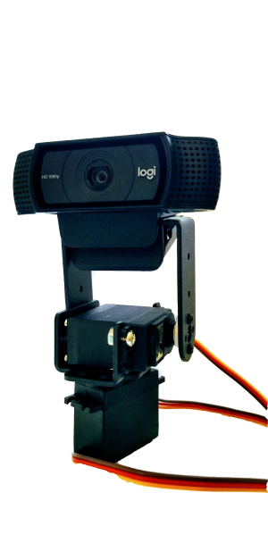
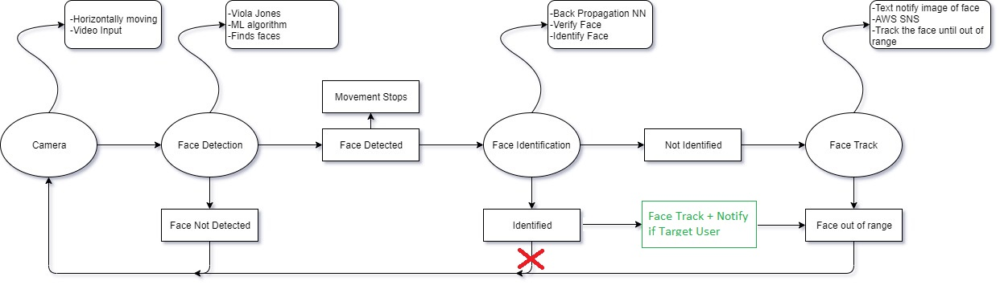
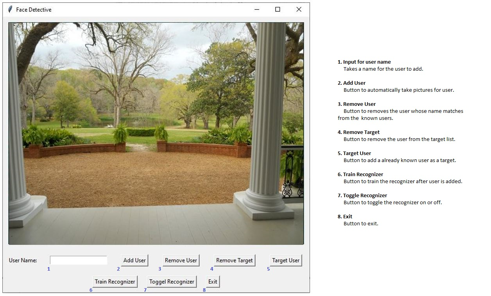
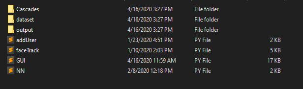

# Face-Detective

 

Have you ever wondered what happens outside your front door when you are out at work or in your room? Did your creepy neighbor steal your last amazon package, or the delivery guy never showed up? Is your ex-girlfriend stalking you? Is the government spying on you? At some point in our living, we have all asked this question. Wouldn’t it be great if something notified us of all the happening when we are not in front of the front door? Well, this project is all about making your own face detective giving you all information of the happening. On a very high level, this project will take live video as an input which is passed through a face detection and face identification algorithm that uses neural network to process the face and send text notification when a face is not identified.

The setup of the project will have a Logitech webcam mounted on top of two motors put together with the help of metal holders. The motors will be able to move up to a range of 180 degrees; one will move the camera horizontally and another vertically. Given the cameras wide range of 180 degrees, the setup will let the camera have a range of 270 degrees. Initially, the camera will move horizontally scanning the video for faces. The movement will only stop when a face is detected. When the face is detected, it is then passed through a neural network with back propagation property which was trained to identify the face in the frame. If the face is identified, then a check is performed on the user. If the face is one of the targets, the detective will take the face as a nonuser i.e. a text alert with a picture of the face will be sent to the user. Additionally, the face will be tracked with the help of motors, now horizontally and vertically, until the face goes out of range. It will only recognize one face.

Further, the user will also be able to add new friendly faces to the system. The user will be allowed to upload pictures and the training of the neural network to identify the face will be automated. The adding of the faces is also automated now with automated picture taking script to take 100 face pictures. The identified face will be recognized later by the system. A new feature to target the user is provided to target a known user who is already recognized by the system.

# Solution Design

# GUI

Steps:
1.	Add User
The first step is to add a user to recognize later. Input a name on the space provided and press ‘Add User’ button. It does not take empty value. The webcam will automatically start taking 100 pictures of you. Make sure to include all the different angles; move face left, right, up, down, in circles. For simplicity, a red rectangular border will be shown around your face. Make sure it’s visible all the time.
2.	Train to Recognize
The next step after you add a user will be to either add another user or train the recognizer. It’s pretty simple. Just hit the button ‘Train Recognizer’ to train the recognizer. It will automate the training process and resume once it has been done.
3.	Turn on the Recognizer
Once completed, press button ‘Toggle Recognizer’ to start the recognition of the user. It should show you the accuracy on top left corner.
4.	Turn on the Target
Ever wanted to target someone you know. Now you can with the ‘Target User’ button. For this, supply the user’s name that you want to target, and it will send you text notification every time the person shows up. Similarly, you can remove the user from the target if you are done with them.	

# Requirements
Hardware List:
•	Laptop – dell xps13
•	Raspberry Pi model 3B
•	Webcam
o	Logitech – C920e
•	2 servo motors
o	MG995, 180-degree rotation, 12kg/cm torque with 6v
•	Metal holder
•	Breadboard, external power, connecting wires, resistor
Software List:
•	Language: Python v3.5.4 (laptop), v3.7 (rPi)
•	IDE: Pycharm (laptop), Geany (rPi)
•	Version Control: Github - https://github.com/aasuraa/SecureToday
•	Python Libraries: 
o	numphy
o	opencv v4.1.0.25 (rPi), v4.1.2.30 (laptop)
o	tensorflow v1.14 (rPi), v2.0.0 (laptop)
o	sklearn v0.21.1 (rPi), v0.21.0 (laptop)
o	pickle, os, boto3, datatime, threading, tkinter, PIL
•	AWS SNS, AWS S3 bucket

# File Hierarchy

# References
http://www.vision.caltech.edu/html-files/EE148-2005-Spring/pprs/viola04ijcv.pdf
https://www.hindawi.com/journals/aans/2011/673016/#B8
https://pinout.xyz/pinout/pin2_5v_power
https://mccormickml.com/2013/12/13/adaboost-tutorial/
https://towardsdatascience.com/an-intro-to-deep-learning-for-face-recognition-aa8dfbbc51fb
https://coding-robin.de/2013/07/22/train-your-own-opencv-haar-classifier.html
https://towardsdatascience.com/how-does-back-propagation-in-artificial-neural-networks-work-c7cad873ea7
